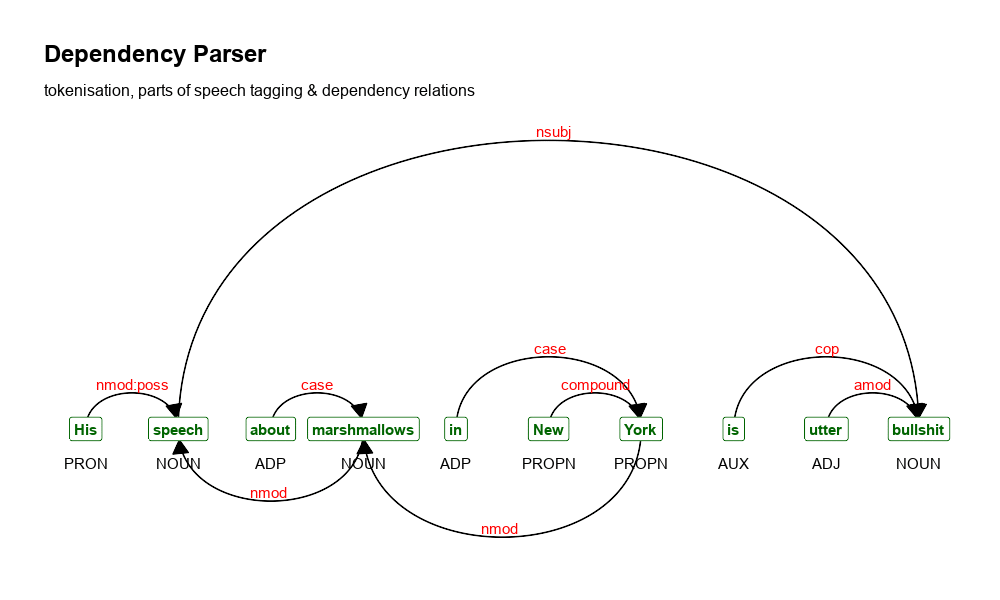

# textplot

This repository contains an R package which provides functionalities to easily visualise complex relations in texts. This is done by providing functionalities for displaying text co-occurrence networks, text correlation networks, dependency relationships as well as text clustering. 



## Installation

- For regular users, install the package from your local CRAN mirror: `install.packages("textplot")`
- For installing the development version of this package: `remotes::install_github("bnosac/textplot")`

Look to the documentation of the functions and run the examples to see what it can do.

```
help(package = "textplot")
```

## Contributions

Feel free to join the effort of providing interesting text visualisations. Following these rules will make this process smooth

- Only put packages in Imports which are either base or recommended packages
- Other packages which you use should be put in Suggests 
    - use requireNamespace("thepackage") if you need functions from thepackage
- Update the gif at `vignettes/textplot-examples.gif` by making an example png of the output of your plot, put it in the dev folder and run the `dev/make-textplot-examples.R` code to update the gif shown in this README

## Support in text mining

Need support in text mining?
Contact BNOSAC: http://www.bnosac.be
